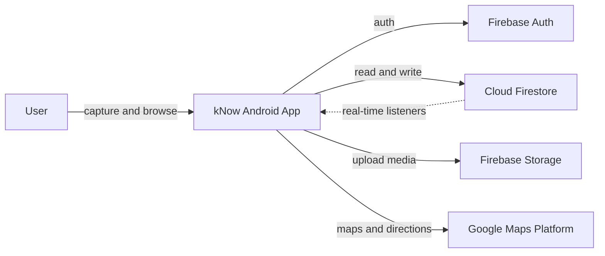

<div align="center">

# kNow

### See what's happening around you — right now.

**A location-first social app that lets you capture photo and video stories, pin them to the map, and explore what people are sharing nearby — then walk there.**

[](https://developer.android.com)
[](https://openjdk.org)
[](https://developers.google.com/maps)
[](https://firebase.google.com)
[](https://developer.android.com/media/camera/camerax)

*Android prototype — map-native social discovery.*

</div>

---

## The problem

Most social feeds are disconnected from place. You scroll past photos and videos with no sense of *where* they happened or whether they're still relevant *right now*. When you're out exploring a city — or trying to decide where to go next — the useful signal is buried in a timeline instead of on the map in front of you.

## The solution

**kNow** turns location into the primary lens for discovery. Capture a photo or short video in the moment, geotag it automatically, and publish it as a **story marker** others can browse on an interactive map. Tap a marker to view the story, follow the creator, or get **walking directions** straight to that spot. Organise your own posts into **custom maps** — personal collections you can curate and share.

Real-time Firestore listeners keep the explore map live as new stories appear around you.

---

## The experience

```text
Sign up -> Explore map -> Capture story -> Tag & publish -> View on map -> Walk there
email /      browse nearby   photo or       caption +        clustered         turn-by-turn
Google       story markers   60s video      category +       markers +         walking route
             + filters                       custom map       story viewer
```

- **Explore** — a Google Map centred on your location, with clustered story markers, category filters (`Food`, `Attraction`, `Past Day`), place search via Google Places, and user search.
- **Capture** — in-app camera powered by CameraX: photo capture, front/back flip, flash, and up to 60-second video recording.
- **Publish** — add a caption, pick a category, attach the story to one or more custom maps, and save with your current GPS coordinates.
- **View** — swipe through stories in a full-screen viewer; tap through to the creator's profile or jump back to the map with GPS navigation to the story location.
- **Profile** — edit your display name and avatar, browse your story gallery, manage custom maps, and see followers / following.
- **Social** — follow and unfollow other users, view public profiles, and block users from settings.
- **Custom maps** — create named map collections with cover images; open any map to see only the stories tagged to it.

---

## Map and navigation

| Feature | What it does |
| --- | --- |
| **Story clustering** | Nearby markers group into clusters; tap a cluster to browse all stories at that spot |
| **Live updates** | Firestore snapshot listeners add, update, and remove markers in real time |
| **Category filters** | Show only Food, Attraction, or stories from the past 24 hours |
| **Place search** | Autocomplete search powered by Google Places, biased to your current viewport |
| **User search** | Find other kNow users by username from the explore screen |
| **Walking routes** | Google Directions API draws a walking polyline from your location to any story marker |
| **Custom map view** | Filter the explore experience down to stories belonging to a specific map collection |

---

## Architecture



Stories are stored in Firestore (`media` collection) with latitude, longitude, caption, category, media type, thumbnail URL, and optional custom map IDs. User profiles live in `Users`; custom map metadata in `map`. Media files are uploaded to Firebase Storage before the Firestore document is written.

---

## Tech stack

| Layer | Tech |
| --- | --- |
| **Platform** | Android, Java 11, minSdk 23, compileSdk 35 |
| **UI** | Material Design, View Binding, Data Binding, Bottom Navigation |
| **Maps** | Google Maps SDK, Places API, Directions API, Maps Utils clustering |
| **Camera and media** | CameraX (photo and video), Media3 ExoPlayer, Glide |
| **Backend** | Firebase Auth, Cloud Firestore, Firebase Storage |
| **Networking** | Retrofit + Gson (Directions API), Volley |
| **Build** | Gradle Kotlin DSL, Android Gradle Plugin 8.9 |

---

## Getting started

### Prerequisites

- [Android Studio](https://developer.android.com/studio) (Ladybug or newer recommended)
- A [Firebase project](https://console.firebase.google.com) with **Authentication**, **Cloud Firestore**, and **Storage** enabled
- A [Google Cloud project](https://console.cloud.google.com) with **Maps SDK for Android**, **Places API**, and **Directions API** enabled

### 1. Clone the repo

```bash
git clone https://github.com/ChimJohn/kNow.git
cd kNow/Prototype
```

### 2. Configure Firebase

1. In the Firebase console, register an Android app with package name `com.prototypes.prototype`.
2. Download `google-services.json` and place it at `Prototype/app/google-services.json`.
3. Enable **Email/Password** sign-in (and optionally Google Sign-In) under Authentication.
4. Create Firestore collections as needed — the app writes to `Users`, `media`, and `map`.

### 3. Configure Google Maps

1. Create an API key in Google Cloud Console with Maps SDK for Android, Places API, and Directions API enabled.
2. Add the key in both places the app reads it from:
   - `Prototype/app/src/main/res/values/strings.xml` → `google_maps_key`
   - `Prototype/app/src/main/AndroidManifest.xml` → `com.google.android.geo.API_KEY` meta-data

> **Security note:** Do not commit production API keys to a public repository. Restrict keys by Android app package and SHA-1 fingerprint in Google Cloud Console.

### 4. Build and run

Open the `Prototype/` folder in Android Studio, sync Gradle, connect a device or emulator with Google Play Services, and run the app.

```bash
./gradlew assembleDebug
```

The app launches at **Login**, then **MainActivity** with three bottom tabs: **Explore**, **Upload**, and **Profile**.

---

## Permissions

| Permission | Used for |
| --- | --- |
| `ACCESS_FINE_LOCATION` | Placing story markers and drawing walking routes |
| `CAMERA` | Capturing photos and videos |
| `RECORD_AUDIO` | Video recording |
| `READ_MEDIA_IMAGES` | Gallery access (Android 13+) |
| `READ/WRITE_EXTERNAL_STORAGE` | Legacy media access (older Android versions) |

---

## Project structure

```text
kNow/
└── Prototype/
    ├── app/
    │   └── src/main/java/com/prototypes/prototype/
    │       ├── MainActivity.java              # Bottom nav shell + location tracking
    │       ├── login/                         # LoginActivity — entry point
    │       ├── signup/                        # SignUpActivity
    │       ├── explorePage/                   # Map, clustering, routes, filters
    │       ├── storyUpload/                   # CameraX capture + story publish
    │       ├── storyView/                     # Full-screen story viewer
    │       ├── user/                          # Profiles, follow graph, gallery
    │       ├── custommap/                     # Custom map CRUD + filtered views
    │       ├── directions/                    # Retrofit Directions API client
    │       ├── firebase/                      # Auth, Firestore, Storage helpers
    │       ├── settings/                      # Logout, delete account, blocked users
    │       └── classes/                       # Story, PhotoStory, VideoStory models
    ├── gradle/libs.versions.toml              # Version catalog
    └── build.gradle.kts
```

---

## Firestore data model

| Collection | Key fields |
| --- | --- |
| `Users` | `username`, `email`, `name`, `profile`, `followers[]`, `following[]` |
| `media` | `userId`, `caption`, `category`, `mediaType`, `mediaUrl`, `thumbnailUrl`, `latitude`, `longitude`, `timestamp`, `mapsID[]` |
| `map` | `name`, `owner`, `imageUrl` |

---

## Disclaimer

kNow is a **prototype** built for exploration and demo purposes. It is not production-hardened — API keys in the repo should be rotated, Firebase security rules should be reviewed before any public deployment, and location/social features should be tested thoroughly on real devices before release.
